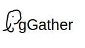

# pg_gather
  

Scan and collect the minimal amount of data needed to identify potential problems in your PostgreSQL database, and then generate an analysis report using that data. This project provides two SQL scripts:  
  
* `gather.sql`: Gathers performance and configuration data from PostgreSQL databases.
* `gather_report.sql`: Analyzes the collected data and generates detailed HTML reports.
  
Everything is SQL-only, leveraging the built-in features of `psql`, the command-line utility for PostgreSQL.

### Minimum Requirements for Data Collection
**PostgreSQL Server Versions**: 10, 11, 12, 13, 14, 15, 16, 17, and 18.  
(**Older versions**: For PostgreSQL 9.6 and older, please refer to the [documentation page](docs/oldversions.md).)  
**Minimum PostgreSQL Client (`psql`) Version**: 11

### Minimum Requirements for Data Analysis
Collected data can be analyzed on **PostgreSQL 16 or above**, which supports the modern analytical functions required for reporting.


# Highlights
1. **Secure and Transparent**: Simple, fully auditable code. To ensure full transparency of what is collected, transmitted, and analyzed, we use an SQL-only data collection script that avoids complex control structures, improving readability and auditability.
2. **No Executables**: No executables need to be deployed on the database host. Using executables in secured environments poses risks. `pg_gather` requires only the standard `psql` command-line utility.
3. **Authentication Agnostic**: Any authentication mechanism supported by PostgreSQL works with `pg_gather`.
4. **Cross-Platform**: Works on Linux (32/64-bit), Solaris, macOS, and Microsoft Windows.
5. **Architecture Agnostic**: Works on x86-64, ARM, Sparc, Power, and other architectures. 
6. **Auditable and Maskable Data**: `pg_gather` collects data in Tab-Separated Values (TSV) format, making it easy to review and audit the information before sharing. Masking or trimming is also possible via [simple steps](docs/security.md).
7. **Cloud and Container Compatible**: Works with AWS RDS, Azure, Google Cloud SQL, on-premises databases, and more.
8. **Zero-Failure Design**: `pg_gather` can generate a report from available information even if data collection is partial due to permission issues or unavailable views.
9. **Low Overhead**: Data collection is separate from analysis. This allows the collected data to be analyzed on an independent system, ensuring analysis queries do not impact your production system.
10. **Small Data Footprint**: `pg_gather` minimizes redundancy to ensure the smallest possible file size, which can be further compressed with `gzip` for easy transmission.
  

# How to Use

## 1. Data Gathering
To gather configuration and performance information, run the `gather.sql` script against the database using `psql`:

```bash
psql <connection_parameters> -X -f gather.sql > out.tsv
```

**OR** pipe the output directly to a compression utility:
```bash
psql <connection_parameters> -X -f gather.sql | gzip > out.tsv.gz
```

*Note: This script may take more than 20 seconds to run due to built-in delays. We recommend running the script as a user with `superuser`, `rds_superuser`, or the `pg_monitor` privilege.*

### Notes for Specific Environments:
1. **Heroku/DaaS**: Some managed services impose high restrictions. Errors encountered when querying views like `pg_statistics` can be safely ignored.
2. **Microsoft Windows**: Use the `psql.exe` included with your client tools (like pgAdmin). 
   Example:
   ```cmd
   "C:\Program Files\pgAdmin 4\v4\runtime\psql.exe" -h pghost -U postgres -f gather.sql > out.tsv
   ```
3. **AWS Aurora**: To handle Aurora-specific differences, you may need to replace incompatible lines in `gather.sql` with `NULL` using `sed`.
   ```bash
   sed -i -e 's/^CASE WHEN pg_is_in_recovery().*/NULL/' gather.sql
   ```
4. **Docker**: Since containers may lack `curl` or `wget`, pipe the SQL file directly to `psql`:
   ```bash
   cat gather.sql | docker exec -i <container_id> psql -X -f - > out.tsv
   ```
5. **Kubernetes**: Use a similar approach to the Docker method:
   ```bash
   cat gather.sql | kubectl exec -i <pg_pod_name> -- psql -X -f - > out.tsv
   ```

### Continuous Data Collection
For requirements involving continuous or repeated data collection, `pg_gather` features a lightweight mode automatically enabled when connecting to the `template1` database. See [documentation for continuous collection](docs/continuous_collection.md).

## 2. Data Analysis

### 2.1 Importing Collected Data
Import the collected TSV file into a **temporary or local** PostgreSQL instance. This will create the required schema in the `public` schema.

**CAUTION:** Never import production data into a critical or production environment.

```bash
psql -f gather_schema.sql -f out.tsv
```

### 2.2 Generating the Report
Generate the HTML report from the imported data using the following command:

```bash
psql -X -f gather_report.sql > GatherReport.html
```

Open the resulting `GatherReport.html` in any web browser.


# ANNEXURE 1: Using Docker and the Wrapper Script

The data analysis process can be fully automated using the `generate_report.sh` script. This script spins up a temporary PostgreSQL Docker container, imports the data, and generates the report automatically.

**Requirements**: The script must be run in a directory containing `gather_schema.sql` and `gather_report.sql`.

**Arguments**:
1. Path to the `out.tsv` file (Required).
2. Desired output path for the HTML report (Optional).
3. A flag (`y`/`n`) to determine whether to keep the Docker container after execution (Optional).

### Examples

**Example 1: Standard usage**
```bash
$ ./generate_report.sh /tmp/out.tsv
...
Container 61fbc6d15c626b484bdf70352e94bbdb821971de1e00c6de774ca5cd460e8db3 deleted
Finished generating report in /tmp/out.html
```

**Example 2: Custom output and keeping the container**
```bash
$ ./generate_report.sh /tmp/out.tsv /tmp/custom-name.html y
...
Container df7b228a5a6a49586e5424e5fe7a2065d8be78e0ae3aa5cddd8658ee27f4790c kept around
Finished generating report in /tmp/custom-name.html
```

# Advanced Configuration

## Timezone
By default, the `pg_gather` report uses the `log_timezone` setting from the source database. This ensures that report timestamps align with your database logs. 

To override this, set the `PG_GATHER_TIMEZONE` environment variable to a valid timezone name or abbreviation (e.g., `UTC`):

```bash
export PG_GATHER_TIMEZONE='UTC'
```

# Demo

## Data Collection
[](https://youtu.be/4EK7BoV6oOg)

## Simple Report Generation (1 min)
[](https://youtu.be/Y8gq1dwfzQU)

## Report Generation via Docker (3 min)
[](https://youtu.be/amPQRzz5D8Y)
