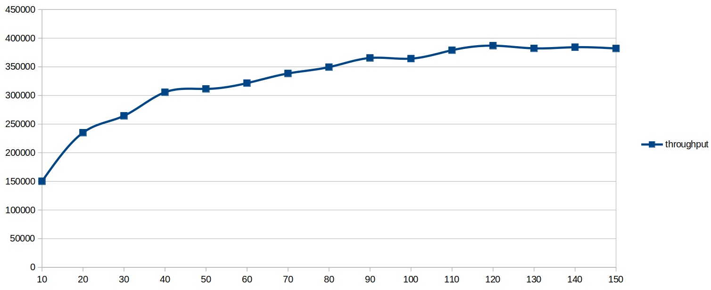
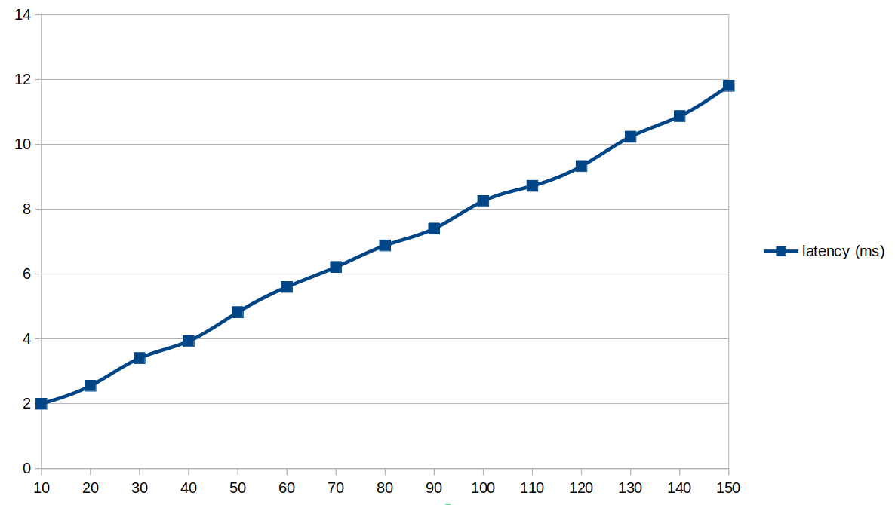

# max_connection settings
Avoid exceeding `max_connections` exceeding **10x** of the CPU count

## Problems of high number of connections
* Possibility of overloading and server become unresponsive / hang
* DoS attacks : System becomes easy target
* Lock Management overhead increases
* Memory utilization (Practically 10-50MB usage per connection is common)
* Snapshot overhead increases
Overall poor performance, responsiveness and stability issuse are often reported with databases with high `max_connection` values

## Best case benchmark result
 Even on a best case senario created using micro-benchmark, we could observe that the thoughput flattens as connections approches 10x of the CPU count  
   
 But at the same time, the latency, the measure of responsiveness goes bad.  
   
As the latency increases individual SQL statments takes longer time to complete. often resulting in complaints of poor performance from the database.
If the latency increases a lot, may part of the systems becomes failing due to timeouts.

## Key concepts to remember
* Each client connection is one process in the database server
* When client connection becomes active (some query to process) the corresponding process becomes runnable at the OS
* One CPU core can handle only 1 runable process at a time.
  * That means, if there are N CPU cores, There will be only N running processes.
* When Runable processes reaches the 5x-10x of the CPU count, Overall CPU utilization hits 100% .
  * There is no benefit of pushing for more concurency if the CPU utilization is hits its maximum.
* Multi-tasking / Context switches by OS gives the preception of multiple processes running by preempting the process frequently
* More runnable processes beyond the CPU counts results in processes waiting in scheduler queue for longer duration, which effectively results in poor performance.
* Increases the processes more just increases the contention in the system.
* PostgreSQL's supervisor process (so called postmaster) need to keep tab on each process it forked.
 * As the process count increases, The work of postmaster become inreases to get snapshot of what’s visible/invisible, committed/uncommitted (aka, Transaction Isolation)
 * It takes longer time to get  `GetSnapshotData()` as the work increases. This results in slow responce.
 * PostgreSQL processs caches the metadata accessed leading to incrased memory utilization over a time
 * Extension libraries will be loaded to the processes, which increases the memory footprint.
  
## Important Articles/References to Read
 1. [Why a high `max_connections` setting can be detrimental to performance](https://richyen.com/postgres/2021/09/03/less-is-more-max-connections.html)
 2. [Analyzing the Limits of Connection Scalability in Postgres](https://www.citusdata.com/blog/2020/10/08/analyzing-connection-scalability/) -- Memory and Poor snapshot scalability 
 3. [Measuring the Memory Overhead of a Postgres Connection](https://blog.anarazel.de/2020/10/07/measuring-the-memory-overhead-of-a-postgres-connection/)
 4. [Manage Connections Efficiently in Postgres](https://brandur.org/postgres-connections)

  
